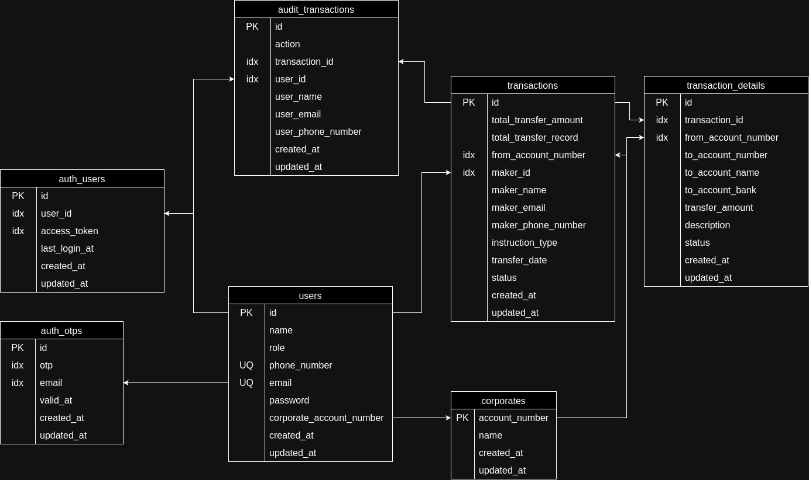

# BNC Batch Transaction

## Features

- Login
- Register
- Home Dashboard
- Create Transaction
- Transaction List

## Design Table



## Tech

- [NextJS] - Framework of React JS!
- [Golang] - for backend
- [Postgresql] - Database
- [Yarn] - for depedencies management node js

## Installation

- Node JS LTS
- Please use yarn to install dependecies NextJS
- Golang 1.2.x
- Postgresql Latest

Install the dependencies and devDependencies to start the web.

```sh
cd web
yarn
```

## Development

You need to add `.env` to folder `api` and `web`

for api:
```
DB_HOST=localhost
DB_USER=postgres
DB_PASSWORD=postgres
DB_NAME=bnc
DB_PORT=5432
```

for web:
```
NEXT_PUBLIC_BASE_URL_API=http://localhost:1323
BASE_URL_API=http://localhost:1323
```

Open your favorite Terminal and run these commands.

First Tab:

```sh
cd web
yarn dev
```

Second Tab:

```sh
cd api
go run main.go
```

## Docker

TODO


   [NextJS]: <https://nextjs.org/>
   [Golang]: <https://go.dev/>
   [Postgresql]: <https://www.postgresql.org/>
   [Yarn]: <https://classic.yarnpkg.com/en/docs>

   [PlDb]: <https://github.com/joemccann/dillinger/tree/master/plugins/dropbox/README.md>
   [PlGh]: <https://github.com/joemccann/dillinger/tree/master/plugins/github/README.md>
   [PlGd]: <https://github.com/joemccann/dillinger/tree/master/plugins/googledrive/README.md>
   [PlOd]: <https://github.com/joemccann/dillinger/tree/master/plugins/onedrive/README.md>
   [PlMe]: <https://github.com/joemccann/dillinger/tree/master/plugins/medium/README.md>
   [PlGa]: <https://github.com/RahulHP/dillinger/blob/master/plugins/googleanalytics/README.md>
